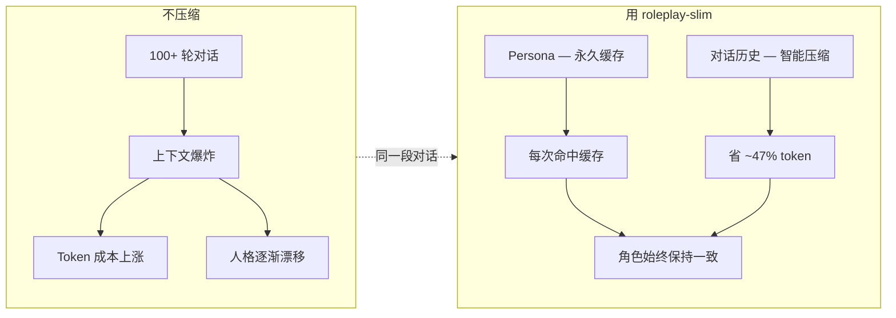
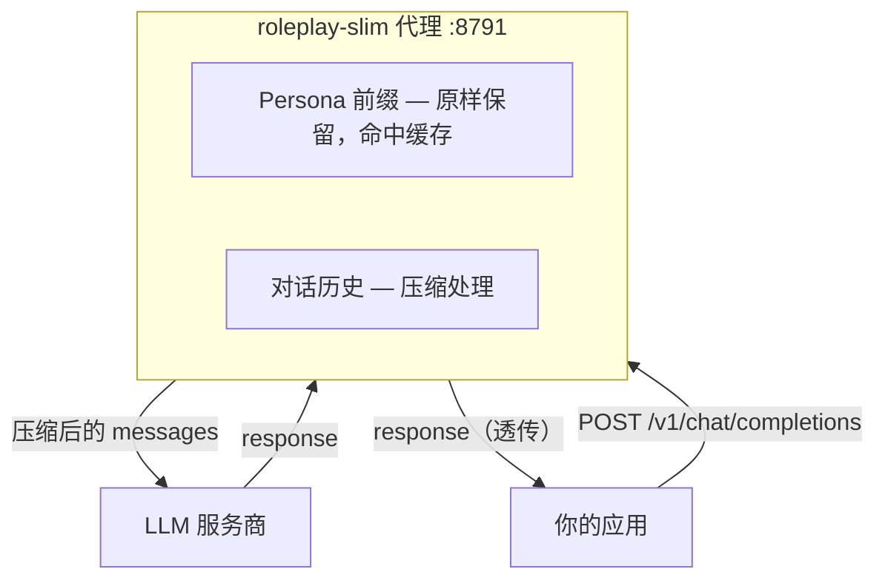

# roleplay-slim

> 让 AI 角色在长对话中始终如一——
> 压掉你付费的部分，护住让他们成为"他们自己"的部分。

面向持久化 AI 角色的轻量级上下文优化层——既是库，也是一个兼容 OpenAI Chat Completions
的代理。它知道 **缓存稳定的 persona 前缀**和**每次请求都要付费的对话历史**之间的区别。

> **并不只适用于角色扮演。** 它保护的结构——稳定前缀 + 每次请求都在变的对话——是
> 大多数聊天类应用共享的形态，即使前缀不是 persona：代码助手的 system prompt、
> RAG 聊天机器人的常驻指令、客服 bot 的护栏。roleplay-slim 在持久化角色 bot 上
> 经受过实战检验，而前缀保护的好处适用于任何存在这种形态的地方。角色扮演是它被
> 证明过的地方，不是它的边界。

[](https://github.com/lucifergzsz414/roleplay-slim/actions)
[](https://www.python.org/)
[](LICENSE)

[English](README.md) · 新手上路？看 [QUICKSTART.md](QUICKSTART.md)（[英文版](QUICKSTART.md)），
零基础也能跑起来。

> **500 轮角色扮演对话** — 37,176 → 19,545 tokens（省 47.4%），
> persona 前缀 100% 保留。[见性能测试](#性能测试) · [30 秒上手](#30-秒上手)

## 问题



## 它做什么

| | |
|---|---|
| **库** | `compress(messages)` — 在你的 Python 应用里直接 import |
| **代理** | 换个 `base_url` 就能用，零代码改动——跑在 `127.0.0.1:8791` |
| **缓存感知** | 自动识别缓存稳定的前缀区，逐字节原样保留 |
| **对话原生** | 为散文体对话设计，不是 JSON——去舞台指示、去重复 footer、裁剪旧轮次 |

### 它在你的架构中的位置



---

## 为什么有这个项目

GitHub 上已经有好几个 LLM 上下文压缩代理了——
[headroom](https://github.com/headroomlabs-ai/headroom)、
[kompact](https://github.com/npow/kompact)、
[KrunchWrapper](https://github.com/naemlucifer/KrunchWrapper) 等等。
它们在各自的目标场景下表现不错：JSON 数据、工具输出、日志、代码。
headroom 自己的数据就说明问题——coding agent 流量省 ~20%，JSON 省 60-95%。
这是因为这些工具只看到纯文本，然后用通用方式压缩。

但它们中没有一个是为**散文体对话**设计的——那种角色扮演伴侣 bot、
character.ai 式应用、或者长期聊天记忆系统实际产出的内容。
用压缩 JSON 的方式去压对话内容，可能会丢掉语气、措辞和情感层次——而这些东西
*本身就是产品价值所在*。roleplay-slim 就是专门为这类内容构建的。

---

## 核心思路

大多数聊天应用发出的 messages 数组长这样：

```
[system]  <固定 persona / 指令 — 每次请求完全一致>
[system]  <固定共享配置 — 每次请求完全一致>
[user]    <第 1 轮>
[assistant] <第 1 轮回复>
[system]  <每轮重复的 footer / 提示 — 每次请求逐字重复>
[user]    <第 2 轮>
...
```

最前面的几条 system 消息在不同请求间通常是**逐字节完全相同的**——DeepSeek 等
服务商对此有自动前缀缓存奖励。如果每次调用都对这段做不同的压缩，等于无声无息地
破坏了服务商自带的缓存，且毫无收益。而它后面的对话历史和 footer，则是每次都
要全额付费的。

roleplay-slim 的默认启发式规则自动识别这个分界——在第一条 `user`/`assistant`
消息之前的所有前导 `system` 消息都被**逐字节原样保留**；压缩只作用于它之后的内容。
不需要为每个应用单独配置就能白拿这一块收益。

这是真正的保证，不是尽力而为：`compress()` 默认绝不会对前缀区执行任何变换。
这跟 [Kompact](https://github.com/npow/kompact) 的 "Cache Aligner" 方案不同
（通过阅读源码而非 README 核验）——Kompact 允许流水线中更早的层像对待普通内容
一样压缩 system prompt，然后事后通过查找易变子串（UUID、时间戳）替换为不透明
占位符来恢复缓存友好性。roleplay-slim 则是在任何策略执行*之前*就识别出前缀区，
然后干脆不动它——不需要重建，因为从一开始就没改过。

---

## 为什么不直接用通用压缩器？

大多数压缩工具把每条消息一视同仁——它们看到一段文本就压缩。这对 JSON 或日志
没问题，但对角色扮演对话会产生两个问题：

| | 通用压缩器 | roleplay-slim |
|---|---|---|
| **Persona 前缀** | 跟其他内容一起压缩——破坏服务商缓存，还可能导致语气和措辞丢失 | 逐字节原样保留——命中缓存，角色依然是这个角色 |
| **对话历史** | 统一压缩——分不清舞台指示、重复 footer 和真实台词之间的区别 | 智能压缩——从旧轮次中去掉舞台指示、去重 footer、裁剪过时轮次、保留最近对话原文 |

```
通用:    [persona] [history] → [压缩成一块] → LLM
               ✗ 缓存被破坏    ✗ 语气有风险

Slim:   [persona] → [原样保留] ───────────────→ LLM
        [history] → [智能压缩] ───────────────→ LLM
               ✓ 命中缓存       ✓ 对话被保护
```

roleplay-slim 的压缩策略只作用于对话部分——persona 前缀在结构上有保证不会被
改动。这不是"尽力而为、看运气"的说法；`compress()` 默认绝不会对前缀区执行
任何变换。

---

## 压缩策略（v0.3，默认全规则式——不依赖 ML 模型，不做有损语义评分）

| 策略 | 作用 | 默认 |
|---|---|---|
| `whitespace_normalize` | 合并多余的空行和空白字符 | 开 |
| `dedupe_verbatim_tail` | 如果完全相同的 footer/提示文字在多轮中重复出现，只保留最后一次 | 开 |
| `history_window` | 保留最近 N 轮原文不动；更早的轮次丢弃、裁剪为首尾句摘要，或交给你自己的摘要函数 | 开 |
| `strip_stage_directions` | 从*较早*的轮次中移除括号/动作描写（`（…）`、`*…*`，视你的应用而定），保留实际台词——差异化核心功能 | 关（格式敏感，需主动开启） |
| `max_prompt_tokens` | 整个 prompt 的硬性上限：丢弃最旧的轮次直到估算值达标 | 关（需主动开启） |

### 不只是形状，还要有上限：`max_prompt_tokens`

上面每条策略都是*结构性*的。"保留最近 6 轮"完全没说这 6 轮有多大，所以压缩
结果本身没有任何体积上界。

这个缺口不是理论问题。`history_window` 的裁剪按句末标点切分，而聊天里的短句
经常根本没有标点——"好的"、"在吗"、"嗯"。切不出两句以上它就原样返回。在 40 轮
这种流量上，实测压缩率是 **1.1%**。

```python
CompressorConfig(keep_recent_turns=4, max_prompt_tokens=800)
```

同样的输入、同样的裁剪策略：**90.0%**，且结果保证在 800 token 以内。

丢弃的单位是整轮，不是单条消息——轮次以每条新 user 消息为界切分，所以
assistant 的 `tool_calls` 和回应它的 `tool` 结果必定在同一轮内。按消息丢会
留下没有对应结果的孤儿 `tool_calls`，服务商会直接拒绝。

有三样东西绝不会为了达成预算而牺牲：缓存前缀、最近 `budget_min_recent_turns`
轮（丢掉待回答的问题等于删掉这次请求本身）、以及会被重新挂回的 recurring
system 消息。达不成的预算会记录日志并如实保持超标，而不是靠破坏 prompt 来
"达成"；且永不抛异常——代理正在处理实时请求，不该因为一个不切实际的上限而 500。

默认关闭。没写这个配置项的老配置，输出与之前**逐字节一致**。

### 接入你自己的摘要函数

规则式策略便宜、可预测，但很钝——见上面那个 1.1%。诚实的选择只有两个：引入 ML
依赖并开始改写角色台词，或者让你自己来做浓缩。这里选了后者：

```python
def my_summarizer(messages: list[dict]) -> str:
    # 你已有的记忆层、一次 LLM 调用，什么都行
    return summarize(messages)

config = CompressorConfig(
    keep_recent_turns=4,
    history_window_mode="summarize",
    summarizer=my_summarizer,
)
```

比 `keep_recent_turns` 更早的消息全部交给你的函数，整段历史被它返回的那**一条**
字符串替代。这个领域的应用通常本来就有记忆/摘要层，其输出远好于任何正则。

50 轮无标点对话实测：`trim` 2.7%、`drop` 92.6%、`summarize` **92.2%**——但
`drop` 是直接扔掉历史，`summarize` 保留了一份浓缩记忆。对伴侣类 bot 来说，
这个区别就是全部意义。

你的回调允许失败，因为它通常是一次网络调用：

| 回调行为 | 结果 |
|---|---|
| 抛异常（超时、API 报错） | 记日志，回退到 `trim`，请求照常发出 |
| 返回 `""` | 视为"这段历史不值得保留"，直接丢弃该段 |
| 返回非字符串 | 记日志，回退到 `trim` |
| 还没有轮次过期 | 根本不调用——不浪费一次请求去摘要空内容 |

天生只能用 Python 配置：callable 无法从 TOML 产生，所以在配置文件里写
`summarizer` 会被明确拒绝并给出说明，而不是拖到压缩内部才报错。

## 性能测试

拿一个 500 轮的角色扮演对话来说——包含 persona 前缀、带舞台指示的中文对话、
每轮重复的 footer——每次请求要向 LLM 发送 37,176 个 token。

| 配置 | 压缩后 token | 节省 |
|---|---|---|
| 不压缩 | 37,176 | — |
| 默认（零调参） | 31,041 | 16.5% |
| + 去舞台指示 | 19,545 | **47.4%** |

Persona 前缀从未被改动——47% 的节省全部来自对话历史，不影响角色的说话方式。

这个规律在不同对话长度下都成立：

| 轮数 | 压缩前 | 默认 | + 去舞台指示 |
|---|---|---|---|
| 50 | 3,966 | 3,366 (15.1%) | 2,355 **(40.6%)** |
| 200 | 15,036 | 12,591 (16.3%) | 8,085 **(46.2%)** |
| 500 | 37,176 | 31,041 (16.5%) | 19,545 **(47.4%)** |

节省比例随对话增长而*提升*——更多轮次超出了 `keep_recent_turns` 窗口，意味着
更多内容被压缩。

对于已经有自己记忆层的应用，`history_window_mode="drop"` + `keep_recent_turns=3`
可以推到 90% 以上。

自己跑：`python benchmark/run_benchmark.py`。

## 什么时候用 / 什么时候跳过

| 如果你…… | 就用 roleplay-slim | 如果你…… | 就跳过 |
|---|---|---|---|
| 跑一个带长聊天历史的角色/扮演 bot | | 只做单轮请求（没有历史可压缩） | |
| 每次请求按 token 计费 | | 用的是包月或不限量 token 套餐 | |
| 有固定的 persona/配置前缀想命中缓存 | | 压根没有缓存稳定的前缀 | |
| 发送对话密集的内容（散文，不是 JSON） | | 主要发结构化数据 / JSON / 工具输出 | |
| 想零代码改动接入一个代理 | | 需要 MCP、多服务商格式转换、或图形界面 | |

## 与同类项目的对比

| | roleplay-slim | [headroom](https://github.com/headroomlabs-ai/headroom) | [kompact](https://github.com/npow/kompact) | [KrunchWrapper](https://github.com/naemlucifer/KrunchWrapper) |
|---|---|---|---|---|
| **目标场景** | 散文体对话 | Agent 工具输出、JSON、代码 | 多步 agentic 轨迹 | 通用文本 |
| **前缀缓存安全** | ✅ 逐字节保证 | ✅ CacheAligner（事后重建） | ⚠️ 压缩后恢复 | ❌ 无前缀概念 |
| **对话感知** | ✅ 舞台指示、footer | ❌ 仅通用文本 | ❌ 仅通用文本 | ❌ 仅通用文本 |
| **依赖 ML** | 否（纯规则） | 是（Kompress-v2-base） | 否（启发式） | 否（启发式） |
| **代理模式** | ✅ OpenAI Chat Completions | ✅ OpenAI + Anthropic | ✅ OpenAI | ✅ OpenAI |
| **MCP 服务** | ❌ | ✅ | ❌ | ❌ |
| **可逆** | ❌（有损裁剪） | ✅ (CCR) | ❌ | ❌ |
| **安装大小** | < 5 MB | 500+ MB（ONNX + 模型） | < 10 MB | < 5 MB |

**v0.2 明确不做的事**（如果你想贡献代码，请先看计划文档）：不做 LLMLingua 式
ML 语义压缩、不做多服务商格式翻译（仅 OpenAI 格式——覆盖 DeepSeek 和大多数
国产模型）、不做跨请求语义缓存/向量库、不做图形界面。

---

### `history_window` 的 trim 模式假设你有（或不需要）外部记忆

`trim` 对较早轮次做简单的首尾句保留——但它不知道哪句话重要。一段埋在消息中间的
承诺或关键信息（比如聊天气时夹杂的"下次给你带一束花"）可能落在被丢弃的中间部分。

这是有意为之的范围边界，不是疏忽：roleplay-slim 是 token 压缩器，不是记忆系统，
它没有办法知道在你的应用场景里哪句话是关键信息——除非调一次 LLM（v0.2
的纯规则边界排除了这个选项）或者用一个脆弱的关鍵词启发式（误判率高，中英文
之外更不可靠）。如果你的应用没有自己的长期记忆/事实提取层在压缩*之前*运行，
要么：

- 切换到 `history_window_mode="drop"`，只依赖 `keep_recent_turns`（没有部分内容
  丢失的风险，只是截断更硬），要么
- 在调用 `compress()` *之前*，把绝对不能丢失的内容（承诺、关键事实、关系状态）
  提取到你自己的持久化存储中——`history_window_mode="drop"` 正是为配合已经做了
  这层工作的应用而设计的（见 `examples/example_config.toml` 的注释）。

### 如果你的前缀其实不是静态的

上面说的逐字节保证，前提是你的前缀确实每次请求都完全一致。如果你的应用在
persona/共享配置块里嵌入了一个每次都会变化的东西——最常见的是实时时间戳——那
前缀自己就把服务商的缓存破坏了，roleplay-slim 的默认行为（不动它）也帮不了你。

`enable_prefix_normalize`（默认关闭）就是为此准备的一个窄而克制的逃生口：它把
前缀中发现的 ISO-8601 时间戳向下取整到最近的
`prefix_timestamp_bucket_minutes` 边界（默认 5 分钟），而不是保留精确到秒。
跟把时间戳替换成不透明占位符不同，这样做保留了真正有用的时间信息——角色扮演的
persona 经常需要大致知道现在几点——同时让同一分桶窗口内的请求保持逐字节一致。

```python
config = CompressorConfig(
    enable_prefix_normalize=True,
    prefix_timestamp_bucket_minutes=5,
)
```

## 多模态内容

`content` 可以是纯字符串，也可以是 OpenAI 格式的 `{"type": "text"|"image_url", ...}`
列表（视觉请求）。所有文本处理策略只操作字符串内容——列表原样透传，不做猜测。
token 估算只计算多模态消息中的文本部分；图片成本不建模。

---

## 测试

精选的 fixture 测试曾漏掉一个真实的 bug（一条重复指令可能因为不同轮次的携带方式
而静默消失——见 commit 历史）。在 fixture 测试之外，
`tests/test_properties.py` 使用 [Hypothesis](https://hypothesis.readthedocs.io/)
生成大量 messages 数组形态（变化前缀长度、轮次数量、哪些 system 消息跨轮重复），
并检查对*任何*输入都必须成立的不变式——前缀原样保留、重复指令不会完全消失、
输出保持格式良好。运行 `pytest` 即可执行两组测试。

---

## 安装

```bash
pip install roleplay-slim              # 只用库
pip install "roleplay-slim[proxy]"     # + HTTP 代理
pip install "roleplay-slim[all]"       # 代理 + 精准 tiktoken 统计，一步到位
```

`[all]` 就是 `[proxy,tokens]`——它存在的原因是你不用记额外的名字就能把一切跑起来；
完整的依赖闭包不到 5 MB（验证过——远没有同类工具中某些 ML-heavy 的 `[proxy]`
extra 那么夸张）。

### 先拿你自己的数据验一遍

这是对你生产 prompt 的**有损**变换，上面写的一切都没法告诉你它对*你的*对话会
做什么——`trim` 到底动不动得了你的消息、你的前缀已经占了多大比例、预算会丢掉
哪几轮。所以开启之前先看一眼：

**前缀占比决定了压缩的天花板。** 前缀按设计永不压缩，那么它在 prompt 里占多大
比例，就有多大比例是压缩碰不到的。人设很长、近期历史很短的应用，剩下可压的内容
本就寥寥，再怎么调参也变不出来；前缀短、身后堆了几百轮对话的应用，则几乎全部可
压。上面那组 benchmark 数字来自后一种形态。在评判自己拿到的数字之前，先确认自己
属于哪一种——`preview` 会直接报出前缀占比（下面输出里的 `~73 tokens (17% of the
prompt)`）。

```bash
roleplay-slim preview conversation.json --keep-recent-turns 2
```

```
========================================================================
roleplay-slim preview
========================================================================
  messages       25  ->    18
  tokens~       425  ->   273   saved 152 (35.8%)
  turns           8

  prefix     1 message(s), ~73 tokens (17% of the prompt) — passed through unchanged

------------------------------------------------------------------------
resulting prompt (18 messages)
------------------------------------------------------------------------
=   system    You are Mutsumi Wakaba, a quiet guitarist. …   [prefix]
+ user      Question 0. …… And a final sentence.
...
= system    [FORMAT] always end with a tag

------------------------------------------------------------------------
gone from the original (12 messages)
------------------------------------------------------------------------
- user      Question 0. This is a first sentence. …
...
```

接受 messages 数组或完整的请求体，来自文件或 stdin——直接抓包 dump 下来的
payload 不用改就能喂进去。不发任何网络请求，不写任何文件。`--json` 只输出压缩
后的 messages 方便管道，`--quiet` 只给摘要。

它刻意**不**声称原文消息和压缩结果之间存在一一对应，因为这种对应关系可靠地
不存在——`trim` 是原地改写，`summarize` 把整段塌缩成一条新消息，去重会从任意
位置删副本。它只报告不用猜就能确定的事：某段内容是否逐字保留下来，以及最终
prompt 到底长什么样。

### 直观感受一下效果

**不压缩** — 每次请求带着全部历史负担：

```
[system] You are Aria, a shy guitarist. Stay in character. ...（380 tokens）
[system] [Session context] Format rules apply.
[user] （推开练习室的门）今天来得好早啊...（第 1 轮）
[assistant] （抬头看了一眼）还没呢...（第 1 轮）
[system] [FORMAT RULE] End your reply with a mood tag.
...（中间 196 轮，同样的 footer 每轮都重复）
```
→ 每次请求 15,036 tokens，每次都要。

**用 roleplay-slim** — 同样的对话，示例配置：

```
[system] You are Aria, a shy guitarist. Stay in character. ...（380 tokens）
[system] [Session context] Format rules apply.
[user] （推开练习室的门）今天来得好早啊...（第 1 轮）
[assistant] （抬头看了一眼）还没呢...（第 1 轮）
...（第 2-195 轮：只保留首尾句，舞台指示已移除）
[user] （竖起大拇指）进步巨大...（第 200 轮，最近的 — 原文保留）
[assistant] （摇摇头）今天不练了...（第 200 轮，最近的 — 原文保留）
[system] [FORMAT RULE] End your reply with a mood tag.（只出现一次）
```
→ 8,085 tokens。同一个角色，同一段对话，**省了 46%**。

### 30 秒上手

```bash
pip install "roleplay-slim[all]"
export UPSTREAM_API_KEY=sk-你的真实 key
roleplay-slim-proxy --config examples/example_config.toml
```

然后把任意 OpenAI 兼容客户端指向 `http://127.0.0.1:8791/v1`：

```python
from openai import OpenAI
client = OpenAI(base_url="http://127.0.0.1:8791/v1", api_key="not-used")
response = client.chat.completions.create(
    model="deepseek-chat",
    messages=your_messages,  # <-- 到达 LLM 之前已被压缩
)
```

每次请求你会在终端看到这样一行：

```
[roleplay-slim] request #1 | 1204 -> 891 tokens (saved 313, 26.0%)
```

---

## 作为库使用

```python
from roleplay_slim import compress, CompressorConfig

config = CompressorConfig(
    keep_recent_turns=3,
    enable_strip_stage_directions=True,
    stage_direction_pattern="fullwidth_parens",  # 或者 "asterisk"、"halfwidth_parens"、
                                                  # "square_bracket"、或你自己的正则
)
compressed_messages = compress(messages, config)
```

## 作为代理使用（零代码改动——换个 base URL 就行）

```bash
export UPSTREAM_API_KEY=sk-...
roleplay-slim-proxy --config examples/example_config.toml
```

然后把你的应用指向 `http://127.0.0.1:8791/v1` 而不是真实服务商地址——
其他一切（auth header 透传、流式）照旧。

每次请求会在你启动代理的终端打印一行摘要，不用轮询 `/stats` 就能看到压缩效果：

```
[roleplay-slim] request #1 | 1204 -> 891 tokens (saved 313, 26.0%)
```

`GET /stats` 以 JSON 格式返回同样的累积数据，方便接入你自己的监控。

#### 是证据，不只是估算

上面那些数字是*估算*——用 `cl100k_base` 去数发往其他服务商的文本。`/stats`
同时也报告服务商自己给出的数据：

```json
{
  "request_count": 3,
  "tokens_before_total": 19263,
  "tokens_after_total": 19083,
  "savings_pct": 0.93,
  "upstream": {
    "usage_sample_count": 3,
    "prompt_tokens_total": 2700,
    "completion_tokens_total": 126,
    "cache_hit_tokens_total": 1536,
    "cache_miss_tokens_total": 1164,
    "cache_hit_pct": 56.89
  }
}
```

关键是 `cache_hit_pct`。本项目的核心主张是"保持前缀逐字节不变，服务商的前缀
缓存就会继续命中"——现在这是一个你能读到的数字，而不是一句需要你选择相信的
承诺。

两组数据互补，谁也替代不了谁：估算值覆盖压缩前后的差值（服务商根本看不到
未压缩的版本），`upstream` 块覆盖你实际被计费的量。

**不要把 `savings_pct` 当成成本数字来读。** `cl100k_base` 是 OpenAI 的分词器，
在中日韩文本上数出来的 token 明显多于自带分词器的服务商实际计费的量——拿
DeepSeek 上报的 `prompt_tokens` 对照，本地估算在中文对话上高出五成有余。
`tokens_before_total` 和 `tokens_after_total` 被同一个系数放大，所以*比值*仍然
有意义；绝对数值、以及任何据此折算出来的钱，都不成立。凡是你在意准不准的判断，
以 `upstream` 块为准。

没有采到样本之前该块是 `null` 而不是一排 0——"没测量"和"测到 0"是两回事。
不报告缓存明细的服务商（OpenAI 就是）其 `cache_*` 字段保持 `null`，而不是
被压成一个误导性的 0% 命中率。流式响应不计入：只有调用方设置了
`stream_options.include_usage` 时才会带 usage。

详细配置见 `examples/example_config.toml`，这是一份参照真实生产角色扮演 bot
的消息结构编写的示例配置。

### 保护代理自身

默认情况下，任何能访问代理 `host:port` 的人都可以使用它——而它持有你真实上游的
API key，这意味着别人可以花你的钱。仅限 `127.0.0.1` 本地使用没问题；如果绑定到
`0.0.0.0` 或放在共享服务器上就要小心。设置 `client_auth_token_env` 为存放共享
密钥的环境变量名，要求每个调用方出示该密钥：

```toml
[proxy]
client_auth_token_env = "PROXY_ACCESS_TOKEN"
```

```bash
export PROXY_ACCESS_TOKEN=一段长的随机字符串
```

调用方需要带上 `Authorization: Bearer 一段长的随机字符串`——这个校验在代理自身
层面完成，与真实上游服务商无关（也不会转发给上游），上游的 key 依然通过
`upstream_api_key_env` 配置。

来自真实上游的非 2xx 响应（限流、鉴权失败、超时）会原样透传——包括状态码和
响应体——无论是普通请求还是流式请求，不会静默变成未处理异常或误导性的 200。

---

## API 覆盖

| | |
|---|---|
| ✅ `POST /v1/chat/completions` | 完整支持——普通和流式 |
| ✅ `GET /v1/models`、`/v1/models/{id}` | 原样透传、不压缩——SillyTavern、OpenWebUI 等客户端连接时会拉这个来填充模型列表 |
| ✅ 其他任意 `/v1/*` 端点 | 原样透传（embeddings 等）。chat completions 之外的端点都不带 `messages`，因此也都不做压缩 |
| ✅ `system` / `user` / `assistant` 角色 | 完整支持 |
| ✅ 流式 (SSE) | 透明透传 |
| ✅ OpenAI 兼容客户端库 | 换 `base_url` 即用 |
| ⚠️ `developer` 角色 | 压缩支持，尚未针对所有服务商格式测试 |
| ⚠️ 多模态 `content`（列表形式） | 原样透传；token 估算仅计算文本部分 |
| ⚠️ 工具调用（`tool_calls` → `tool` → `assistant`） | 链路原子性保留，但代理本身不执行工具 |
| ❌ `POST /v1/responses` | 不支持（仅 Chat Completions） |
| ❌ 函数执行 | 代理压缩 messages；不运行你的工具 |

## 状态

v0.4 — 已在真实生产流量上构建并自用验证。209 个测试，含基于 Hypothesis
的属性测试（对生成的各种消息结构验证不变量）。

生产使用实打实抓出并修复过两个问题，评估要不要用在自己的部署上时值得了解：

- **多个调用方共用一个代理实例。** 客户端鉴权门（`client_auth_tokens_extra`）
  的存在，是因为真实部署里出现了多个内部服务共用同一个代理实例的情况——
  各自有各自的凭据，但都命中同一份缓存热的前缀。不是假想场景。
- **遥测绝不能拖垮代理本身。** `/stats` 持久化的早期版本假定 SQLite
  文件所在目录可写；在真实的 systemd 服务下（CWD 不可写）会导致启动即
  崩溃循环。已修复为优雅降级到纯内存 + 打警告日志，
  见 [CHANGELOG.md](CHANGELOG.md) 0.4.0 一节。

跑测试的方法、CI 门槛检查什么、从哪里开始贡献，见
[CONTRIBUTING.md](CONTRIBUTING.md)（英文，含中文可读性问题欢迎提 issue）——
特别欢迎为其他应用的格式约定贡献 `stage_direction_pattern` 预设。
已完成和下一步计划见 [ROADMAP.md](ROADMAP.md)。

## 许可证

MIT
